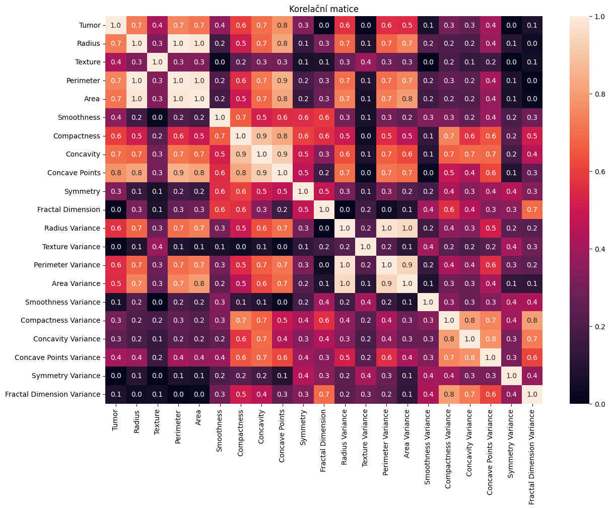
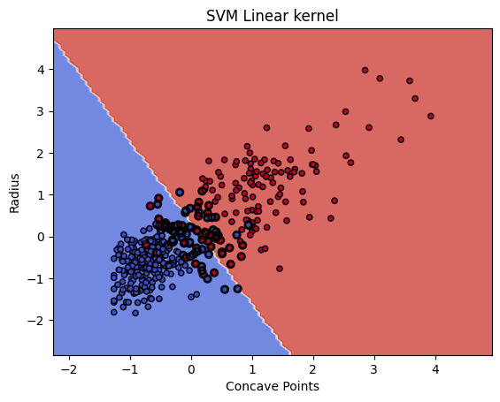
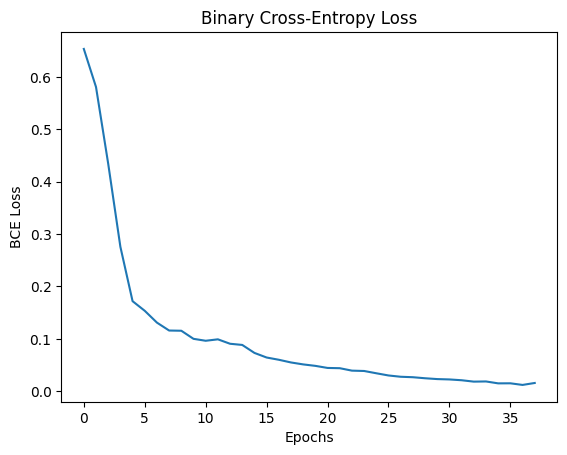
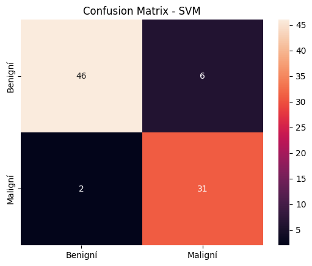
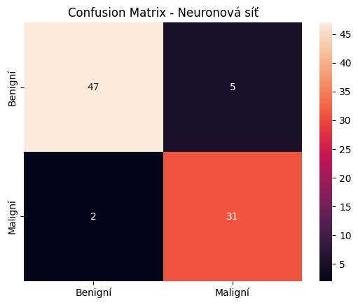

# Predikce rakoviny prsu - Breast Cancer Classification

> **Typ úlohy**: Binární klasifikace  
> **Algoritmy**: SVM (Support Vector Machine) + Neuronová síť (PyTorch MLP)  
> **Dataset**: Breast Cancer Wisconsin (Prognostic) - poskytnuta vyučujícím 
> **Jazyk**: Python 3.x | scikit-learn | Keras / TensorFlow

---

## Popis obchodní úlohy (Business Problem)

Rakovina prsu je jedním z nejčastějších onkologických onemocnění u žen na světě.
Včasná a přesná diagnostika - rozlišení nezhoubného a zhoubného nádoru -
má přímý vliv na volbu léčby a přežití pacientky.

**Cíl projektu**: Vytvořit ML model, který na základě **vlastností buněčných jader**
(získaných z biopsie) automaticky předpoví, zda je nádor nezhoubní nebo zhoubní.

**Využití v praxi**:
- Podpora rozhodování lékaře při diagnóze
- Druhý názor při hraniční diagnóze
- Zrychlení procesu vyhodnocení výsledků biopsie

---

## Dataset

| Vlastnost | Hodnota |
|---|---|
| Zdroj | Upravená verze datasetu poskytnutá vyučujícím (původ: Breast Cancer Wisconsin - UCI ML Repository) |
| Soubor | `data/rakovina_prsou.csv` |
| Počet záznamů | 569 pacientek |
| Počet příznaků | 23 vstupních (po čištění: 13) |
| Cílová proměnná | `Tumor` - M (maligní = 1), B (benigní = 0) |
 
> Dataset byl předem upraven vyučujícím (částečné předzpracování) a **není totožný** s originálním UCI souborem.

### Příznaky datasetu

Příznaky jsou odvozeny z digitalizovaného snímku FNA (aspirát z tenké jehly) a popisují vlastnosti buněčných jader:

| Příznak | Popis |
|---|---|
| Radius | Průměrná vzdálenost od středu k okrajům jádra |
| Texture | Směrodatná odchylka hodnot šedi |
| Perimeter | Obvod jádra |
| Area | Plocha jádra |
| Smoothness | Místní odchylka délek poloměrů |
| Compactness | Kompaktnost tvaru jádra |
| Concavity | Závažnost konkávních částí obrysu |
| Concave Points | Počet konkávních bodů obrysu |
| Symmetry | Symetrie jádra |
| Fractal Dimension | Fraktální dimenze okraje |
| *Variance sloupce* | Variabilita výše uvedených příznaků napříč buňkami vzorku |

---


## ML řešení

### Proč SVM?

SVM (Support Vector Machine) je vhodný pro:
- Menší datasety s dobře definovanými příznaky 
- Binární klasifikaci 
- Situace kde je důležitá **interpretovatelnost hranice rozhodování** 
- Robustnost vůči odlehlým hodnotám (outliers) 

### Proč neuronová síť (MLP)?

MLP (Multi-Layer Perceptron) umožňuje:
- Zachycení nelineárních vztahů mezi příznaky 
- Potenciálně vyšší přesnost při správném nastavení 
- Srovnání s klasickým přístupem 

---

## Architektura projektu

```
BREAST-CANCER-PROJECT/
│
├── data/
│   └── rakovina_prsou.csv          # Dataset (UCI Breast Cancer Wisconsin)
│
├── notebooks/
│   ├── rakovina_prsou.ipynb        # Hlavní notebook s analýzou a modely
│   ├── scaler.bin                  # Uložený StandardScaler
│   ├── svm_model.sav               # Uložený natrénovaný SVM model
│   └── classification_model.pt     # Uložené váhy neuronové sítě (PyTorch)
│
├── images/                         # Vizualizace pro README
│
├── pipeline.py                     # Celý ML pipeline (EDA → model → metriky)
├── requirements.txt                # Závislosti projektu
├── README.md                       # Tento soubor
└── .gitignore
```

---

## ML Pipeline

```
Načtení dat (CSV)
       ↓
EDA - popis, histogramy, box ploty
       ↓
Čištění - odstranění ID, Time sloupců
       ↓
Kódování - Tumor: M→1, B→0
       ↓
Výběr příznaků - korelační matice, odstranění multikolinearity (23 → 13 příznaků)
       ↓
Standardizace - StandardScaler (μ=0, σ=1)
       ↓
Rozdělení dat - Train 75% / Val 15% / Test 10% (426 / 85 / 58 vzorků)
       ↓
┌──────────────────────────┬──────────────────────────────┐
│   SVM model              │   Neuronová síť (MLP)        │
│   scikit-learn           │   PyTorch                    │
│   GridSearchCV (cv=5)    │   4 skryté vrstvy + Sigmoid  │
└──────────────────────────┴──────────────────────────────┘
       ↓                              ↓
  Metriky SVM                   Metriky MLP
       ↓                              ↓
         Porovnání modelů (accuracy, precision, recall, F1)
               ↓
         Uložení modelů a scaleru
```

---

## Analýza dat
 
### Korelační matice
 

 
Na základě korelační matice byly odstraněny sloupce s multikolinearitou (Radius/Perimeter/Area, Compactness/Concavity, Perimeter Variance/Area Variance) a příznaky se slabým vztahem k cílové proměnné (Fractal Dimension, Texture Variance, Symmetry Variance). Z 23 vstupních příznaků zůstalo **13 relevantních**.
 
---

## Výsledky modelů

| Model | Validace (85 vz.) | Test (58 vz.) |
|---|---|---|
| SVM Linear (baseline) | 90,59 % | — |
| SVM + GridSearchCV | 92,94 % | 96,55 % |
| Neuronová síť (MLP) | 92,94 % | 96,55 % |

**Nejlepší parametry SVM:** `kernel='poly', C=1, degree=1, gamma=0.7`

### SVM – hranice rozhodování
 

 
Vizualizace na 2 nejdůležitějších příznacích (Concave Points a Radius). Maligní nádory (červená) mají vyšší hodnoty obou příznaků, benigní (modrá) nižší. Kroužky označují support vektory – body, které definují hranici.
 
### Trénování neuronové sítě
 

 
Ztrátová funkce (Binary Cross-Entropy) plynule klesá s rostoucím počtem epoch, model se učí správně bez známek divergence.
 
### Confusion matrix na validační sadě
 
<table>
<tr>
<td></td>
<td></td>
</tr>
<tr>
<td align="center"><b>SVM (GridSearchCV)</b></td>
<td align="center"><b>Neuronová síť</b></td>
</tr>
</table>

|  | SVM | Neuronová síť |
|---|---|---|
| Správně benigní (TN) | 46 | 47 |
| Správně maligní (TP) | 31 | 31 |
| Falešný poplach (FP) | 6 | 5 |
| **Přehlédnutý nádor (FN)** | **2** | **2** |
 
**Recall pro třídu Maligní na testu:**
- SVM: 0,95 (přehlédl 1 z 21 maligních případů)
- Neuronová síť: **1,00** (zachytil všechny maligní případy)
---

## Závěr a porovnání modelů

Oba modely dosáhly shodné přesnosti – 92,94 % na validaci a 96,55 % na testu. Rozdíl je v **typu chyb**, což je u medicínské diagnózy důležitější než samotná přesnost.

**Neuronová síť** na testu nepřehlédla ani jeden maligní nádor (recall = 1,00), ale generuje více falešných poplachů.

**SVM** dělá méně falešných poplachů, ale na testu jeden maligní případ přehlédl.

Pro reálné nasazení je **vhodnější neuronová síť** – v medicíně je přehlédnutý nádor (False Negative) mnohem nebezpečnější než falešný poplach. Pacientka raději podstoupí další vyšetření, než aby zůstala bez léčby.

**Omezení:** Testovací sada má pouze 58 vzorků.
 
---

## Instalace a spuštění

```bash
# 1. Klonování repozitáře
git clone https://github.com/mirovisus/breast-cancer-project.git
cd BREAST-CANCER-PROJECT
 
# 2. Vytvoření virtuálního prostředí
python -m venv .venv
.venv\Scripts\activate        # Windows
# nebo: source .venv/bin/activate  # Linux/Mac
 
# 3. Instalace závislostí
pip install -r requirements.txt
 
# 4. Spuštění celého pipeline
python pipeline.py
 
# 5. Nebo otevřít notebook
jupyter notebook notebooks/rakovina_prsou.ipynb
```

---

## Závislosti

Viz `requirements.txt`. Klíčové knihovny:
- `pandas`, `numpy` - zpracování dat
- `scikit-learn` - SVM, StandardScaler, GridSearchCV, metriky
- `matplotlib`, `seaborn` - vizualizace
- `tensorflow` / `keras` - neuronová síť
- `joblib`, `pickle` - ukládání modelů

---

## Autor

Školní projekt - předmět Strojové učení (BMLAI)  
Autor: Vasilisa Pozdniakova  
Dataset: upraven a poskytnut vyučujícím (původní zdroj: Breast Cancer Wisconsin Prognostic, UCI ML Repository)